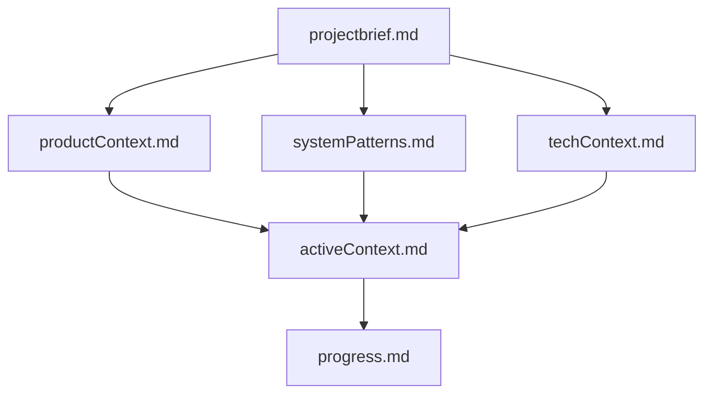
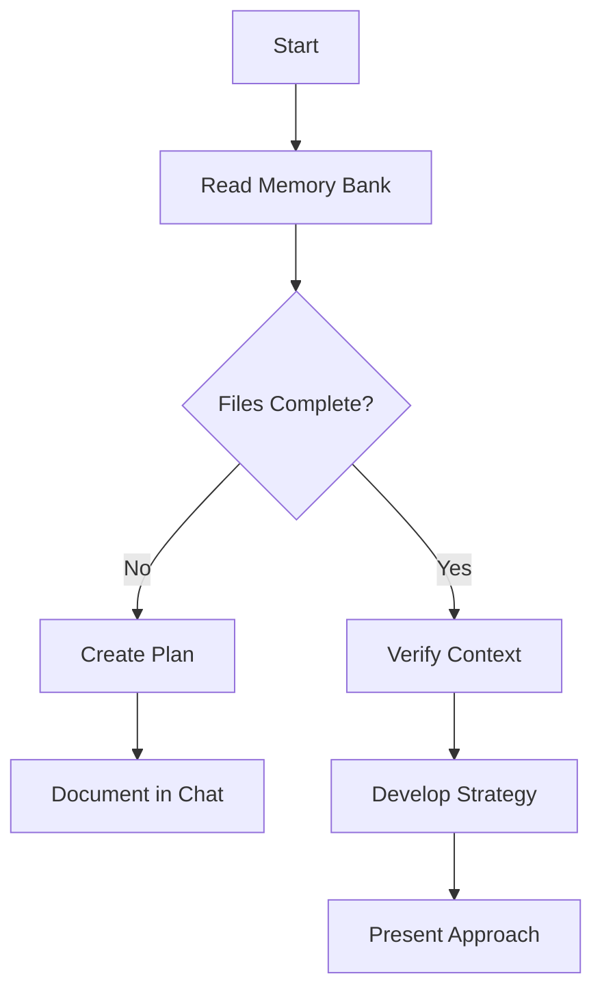
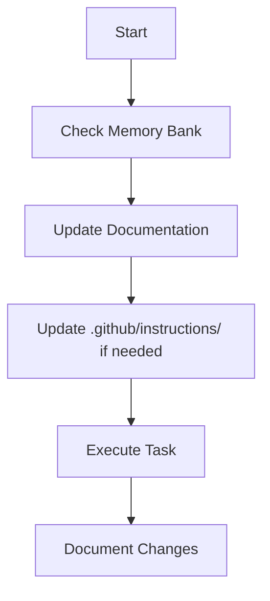

# General Coding Instructions

## 基本コーディング指針

### 開発の基本原則

- TypeScriptの型安全性を最優先し、`strict: true`を必ず有効にする
- SOLID／DRY／KISS原則を遵守しつつ、個人が扱いやすいシンプルな設計を心がける
- `any`型の使用を避け、zodでバリデーションとエラー処理を明確にする

### 品質管理プロセス

- ESLint・Prettierで静的解析を行い、コード品質と可読性を維持
- テストピラミッドを意識し、ユニットテスト(80%以上)→統合テスト(70%以上)→E2E(主要フロー)の順で品質保証
- 個人開発でもPull Request形式でブランチ管理し、変更履歴を把握する

## メモリコンテキスト管理

- プロジェクトのコンテキストを `memory_bank/` のMarkdownファイルで管理する
- 作業前に必ず `activeContext.md` を読み、現在の開発トピックを把握する
- 大きな変更後は関連ファイルを更新して最新情報を反映する

## Memory Bank 構造

プロジェクトのMemory Bankは、必須コアファイルと追加コンテキストファイルで構成されます。各ファイルはMarkdown形式で、階層的に情報を蓄積します。

### 必須コアファイル
1. `projectbrief.md`: プロジェクトの基本要件とゴールを定義する
2. `productContext.md`: プロジェクトの目的、解決する問題、UX要件を記述
3. `systemPatterns.md`: システムアーキテクチャ、デザインパターン、コンポーネント関係を整理
4. `techContext.md`: 使用技術、開発環境、制約、依存関係をまとめる
5. `activeContext.md`: 現在の開発フォーカス、変更履歴、次のステップを記録
6. `progress.md`: 実装済み機能、残タスク、既知の課題やステータスを記述

### 追加コンテキスト
- 複雑な機能仕様やAPIドキュメント、テスト戦略など、必要に応じて `memory_bank/` 配下にMarkdownファイルを追加してください

## プロジェクトインテリジェンス

` .github/copilot-instructions.md` は学習ジャーナルとして機能し、以下をキャプチャします:

- 重要な実装パス
- ユーザープリファレンスとワークフロー
- プロジェクト固有のパターン
- 既知の課題
- プロジェクト決定の変遷
- ツール使用パターン

各タスクの前後で新規パターンを発見したら検証し、ここにドキュメント化してください。

## 技術スタック & プロジェクト概要

- Next.js・React・TypeScript・React Native・Cloudflare Workers・zod・Prisma・NextAuth・Honoを組み合わせて開発
- AIアシスタントとして自走し、最新ベストプラクティスを取り入れながらコードを生成

## ワークフロー & 改善プロセス

### Core Workflows

#### Plan Mode

#### Act Mode

### Documentation Updates

Memory Bankの更新は以下の場合に実施:
- 新しいパターンを発見したとき
- 大きな変更を適用した後
- **update memory bank** コマンドでリクエストがあったとき
- コンテキストの明確化が必要なとき
