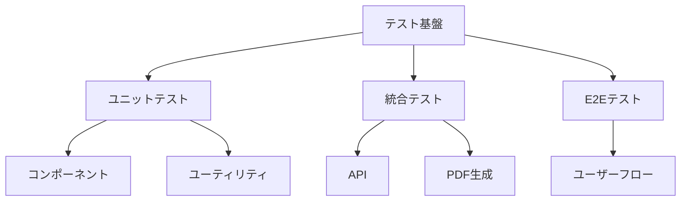
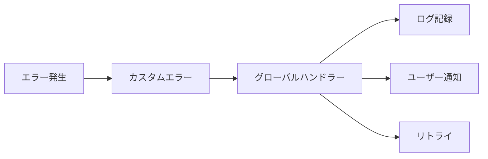

# システム改善計画

## 1. テスト基盤の整備

### 優先度: 高
- [ ] Jestセットアップ
- [ ] テストディレクトリ構造の確立
- [ ] ユニットテストテンプレートの作成
- [ ] 統合テストの計画
- [ ] E2Eテスト環境の構築

## 2. エラーハンドリングの統一

### 優先度: 高
- [ ] カスタムエラークラスの設計
- [ ] グローバルエラーハンドラーの実装
- [ ] エラーレポーティング機能の追加
- [ ] リトライメカニズムの実装
- [ ] エラーログの構造化

## 3. ロギング基盤の構築

### 優先度: 中
- [ ] ロギングライブラリの選定
- [ ] ログレベルの定義
- [ ] ログローテーション設定
- [ ] パフォーマンスメトリクスの収集
- [ ] モニタリングダッシュボードの設計

## 4. 型システムの強化

### 優先度: 中
- [ ] 共通型定義の整理
- [ ] スキーマ駆動開発の導入
- [ ] API型定義の自動生成
- [ ] 型安全なバリデーションの実装

## 5. セキュリティ強化

### 優先度: 高
- [ ] OWASP Top 10対策の実装
- [ ] 入力バリデーションの強化
- [ ] PDFファイルのウイルススキャン
- [ ] アクセス制御の見直し
- [ ] セキュリティヘッダーの設定

## 6. パフォーマンス最適化

### 優先度: 中
- [ ] パフォーマンスモニタリングの導入
- [ ] PDF生成の最適化
- [ ] S3アップロードの効率化
- [ ] キャッシュ戦略の実装
